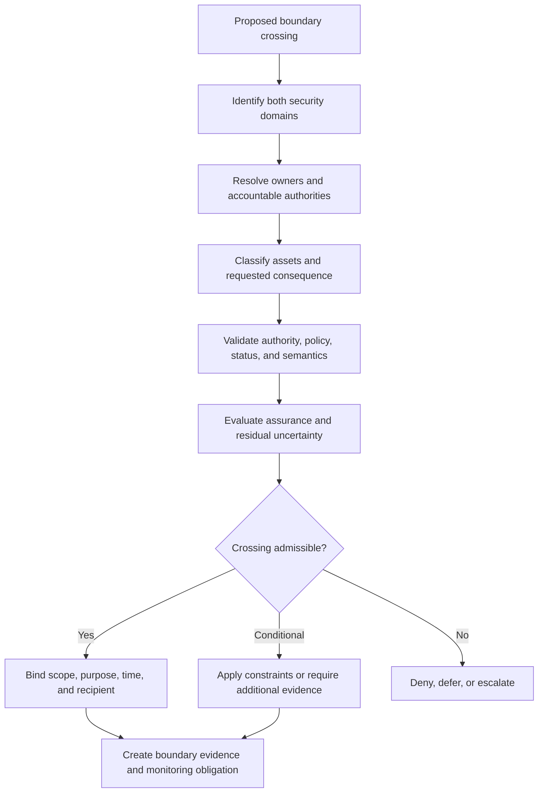
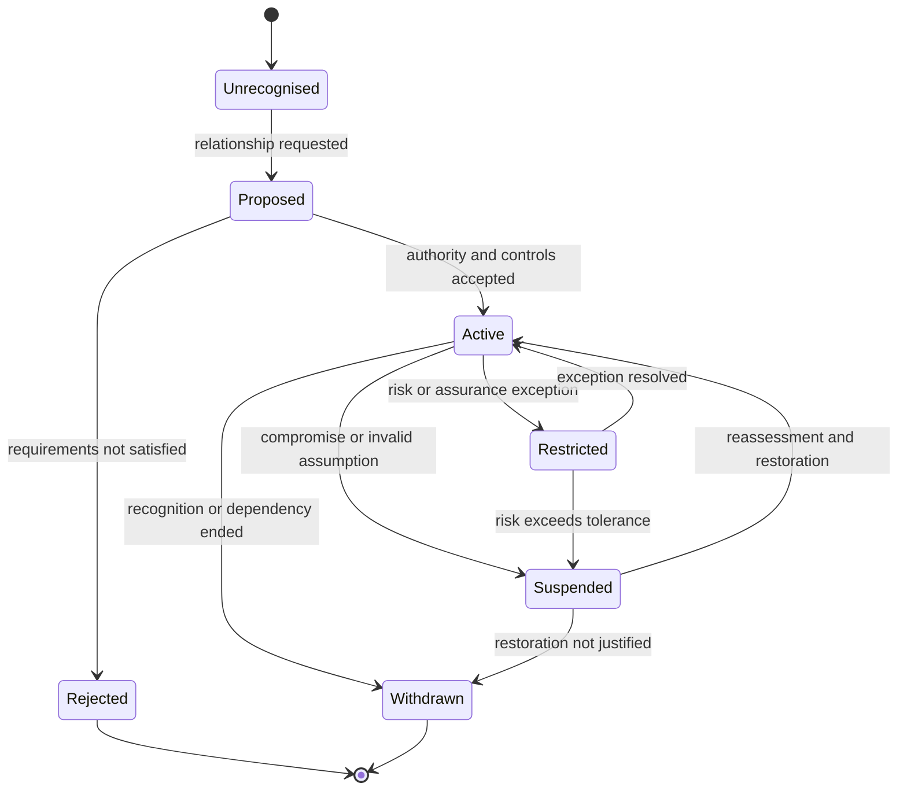

# Security boundary model

A security boundary exists wherever authority, control, semantics, evidence quality, administrative responsibility, or consequence changes. It is not limited to a network perimeter. A boundary can exist inside one organisation, one application, one transaction, or one automated workflow.

This model specialises the reference architecture's [trust-boundary model](../architecture/trust-boundaries.md) for security analysis. It defines what MUST be established before information, authority, assurance, or executable instructions cross between domains.

## Boundary evaluation model

A successful technical connection MUST NOT be treated as evidence that a boundary crossing is authorised, semantically valid, or safe.

## Security boundary catalogue

| ID | Boundary | Typical crossing | Primary security failure |
|---|---|---|---|
| SB-01 | Constitutional or statutory mandate to governing authority | legal mandate becomes operating power | mandate expansion or obsolete authority |
| SB-02 | Governing authority to scheme operator | policy and decision rights are delegated | unbounded delegation or weak oversight |
| SB-03 | Scheme operator to technical operator | governed responsibility becomes system privilege | operator exercises policy power without authority |
| SB-04 | Administrator to privileged service | human or machine administrator changes protected state | credential theft, insider abuse, unauthorised configuration |
| SB-05 | Participant to trust scheme | identity, role, standing, or evidence enters the scheme | impersonation, false enrolment, stale standing |
| SB-06 | Principal to delegate | authority is exercised by another actor or agent | delegation laundering, amplification, or persistence |
| SB-07 | Issuer to holder or subject | an assertion is created for later use | false, excessive, or mis-scoped assertion |
| SB-08 | Holder to verifier | claims and evidence are disclosed | over-disclosure, replay, coercion, correlation |
| SB-09 | Evidence source to verifier | externally produced evidence is relied upon | substitution, tampering, semantic mismatch |
| SB-10 | Registry or status service to resolver | authoritative state is returned | poisoning, equivocation, stale or unavailable status |
| SB-11 | Policy authority to policy engine | human policy becomes executable rules | mistranslation, unauthorised rule change, hidden exception |
| SB-12 | Verifier or resolver to decision service | evaluated evidence becomes a proposed outcome | confidence inflation, omitted uncertainty, context loss |
| SB-13 | Decision service to effect executor | a decision authorises a real-world or digital effect | replay, substitution, effect beyond decision scope |
| SB-14 | Effect executor to affected party | system action changes rights, access, money, status, or exposure | unnotified or irreversible harm |
| SB-15 | Production service to evidence store | operational events become accountability evidence | suppression, alteration, selective logging |
| SB-16 | Operator to assessor or auditor | operational evidence supports an assurance claim | evidence shaping, self-assessment, scope concealment |
| SB-17 | Domestic domain to foreign domain | evidence, status, or assurance is recognised externally | false equivalence, legal mismatch, withdrawal lag |
| SB-18 | Primary service to external dependency | cloud, library, identity, time, network, or key service is relied upon | inherited compromise or unavailable critical dependency |
| SB-19 | Automated agent to tool or downstream agent | delegated capability becomes executable action | prompt or instruction manipulation, mandate escape |
| SB-20 | Incident authority to emergency control | emergency power changes normal safeguards | excessive duration, weak review, abuse of emergency authority |
| SB-21 | Trust system to challenge and redress function | decision evidence becomes reviewable | evidence denial, inaccessible process, retaliatory control |
| SB-22 | Public transparency surface to society | notices, policies, status, and reports become publicly relied upon | misleading publication, omission, or inconsistent versions |

## Required boundary-crossing properties

Every material boundary crossing MUST establish the following properties where applicable:

| Property | Required question |
|---|---|
| Source | Which authoritative actor, service, or domain produced the input? |
| Recipient | Which actor, service, domain, or affected population receives the input or consequence? |
| Authority | What current mandate permits the crossing and the proposed use? |
| Purpose | Why is the crossing necessary, and which purposes are prohibited? |
| Scope | What actions, claims, records, population, jurisdiction, and duration are covered? |
| Semantics | Do both sides interpret the information and assurance claims consistently? |
| Status | Is the source, authority, credential, policy, and recognition state current? |
| Assurance | What confidence is justified, and what limitations remain? |
| Protection | Which confidentiality, integrity, minimisation, replay, and containment controls apply? |
| Accountability | Which evidence will be preserved, and who answers for error or abuse? |
| Redress | How can an affected party challenge the crossing or resulting effect? |
| Failure behaviour | Does the system deny, defer, degrade, constrain, or escalate when validation fails? |

## Boundary states

A boundary SHOULD have an explicit operational state:

The boundary state MUST be discoverable by dependent services where stale reliance could create material harm.

## Boundary evidence

A material crossing SHOULD produce or reference evidence sufficient to establish:

- the boundary and domains involved;
- the actor or service initiating the crossing;
- the authority and policy applied;
- the assets transferred, disclosed, or acted upon;
- validation and assurance results;
- constraints and permitted downstream use;
- time and status references;
- the resulting decision or effect;
- monitoring, expiry, and revocation obligations;
- redress and responsible authority.

The evidence MAY be distributed across several authoritative records. It MUST remain correlatable for authorised audit and challenge without creating unnecessary population-scale tracking.

## Boundary failure modes

Security analysis MUST consider at least:

- **boundary confusion**, where one side assumes responsibilities held by the other;
- **authority smuggling**, where technical access is presented as institutional permission;
- **semantic substitution**, where a claim is translated into a stronger or different meaning;
- **assurance transitivity**, where confidence is inherited beyond the assessed scope;
- **status lag**, where revocation, suspension, or withdrawal does not propagate in time;
- **context stripping**, where purpose, jurisdiction, recipient, or transaction constraints are lost;
- **control bypass**, where a direct integration avoids the governed crossing path;
- **evidence suppression**, where the crossing occurs without a usable record;
- **failure externalisation**, where the receiving domain or affected party bears risk it cannot observe or control;
- **recovery asymmetry**, where one side restores service without resolving downstream effects.

## Relationship to attack-surface work

A boundary is not itself an attack surface, but it identifies where an attack can change trust meaning or consequence. The next security commits will map boundary IDs to protected assets, threat events, attacker objectives, controls, and detection evidence.
