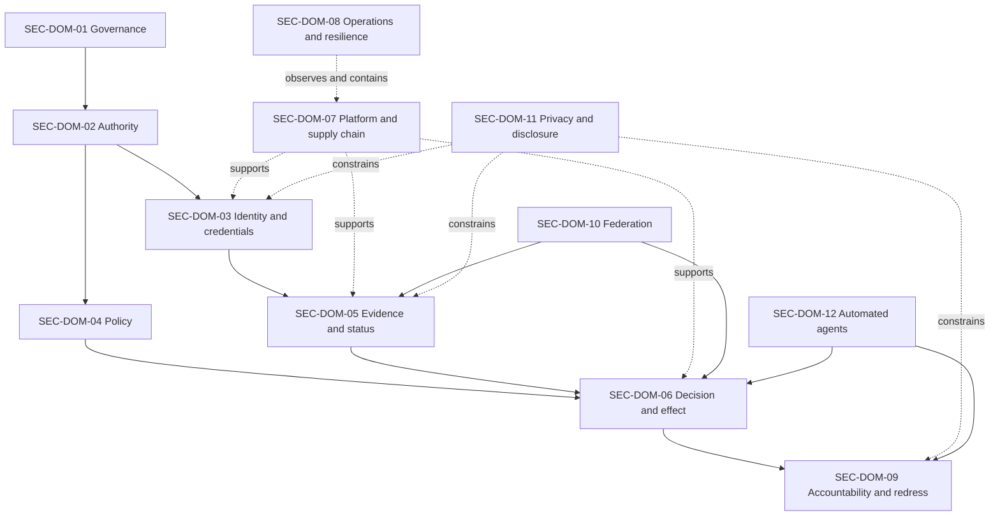

# Security domains

Security domains organise responsibilities, threat analysis, controls, evidence, and assurance. They do not prescribe organisational boundaries. A single organisation may operate several domains, and one domain may be distributed across several organisations. Such arrangements must preserve accountability and make concentration risk visible.

## Domain catalogue

### SEC-DOM-01 — Governance and mandate security

Protects legal and institutional mandate, governance instruments, decision rights, emergency powers, conflicts of interest, and accountable change.

**Typical responsibilities:** governing authority, regulator, policy owner, independent reviewer.

**Principal failures:** governance capture, unauthorised rule change, unbounded emergency action, suppressed oversight.

### SEC-DOM-02 — Authority and privilege security

Protects authority grants, delegations, role assignments, administrative privileges, attenuation, suspension, and termination.

**Typical responsibilities:** authority administrator, entitlement service, delegator, supervisory authority.

**Principal failures:** privilege escalation, delegation laundering, orphan authority, unauthorised re-delegation.

### SEC-DOM-03 — Identity, credential, and authenticator security

Protects enrolment, binding, issuance, possession or control, authentication, lifecycle state, and recovery.

**Typical responsibilities:** identity provider, credential issuer, holder service, authenticator provider.

**Principal failures:** synthetic identity, account takeover, credential cloning, weak recovery, holder substitution.

### SEC-DOM-04 — Policy and rule security

Protects policy authorship, approval, publication, version selection, interpretation, evaluation, exception, and retirement.

**Typical responsibilities:** policy authority, policy registry operator, decision-service operator.

**Principal failures:** policy tampering, downgrade, ambiguous applicability, hidden exception, inconsistent evaluation.

### SEC-DOM-05 — Evidence, registry, and status security

Protects evidence provenance, integrity, freshness, source authority, registry records, status events, and disclosure scope.

**Typical responsibilities:** evidence provider, registry authority, status service, verifier.

**Principal failures:** evidence substitution, registry poisoning, stale status, selective suppression, over-disclosure.

### SEC-DOM-06 — Decision and effect security

Protects contextual verification, assurance evaluation, decision construction, effect admission, execution binding, replay resistance, and correction.

**Typical responsibilities:** verifier, trust-resolution service, decision service, effect executor.

**Principal failures:** wrong-context acceptance, manipulated decision, effect mismatch, replay, unsafe automation.

### SEC-DOM-07 — Platform, software, and supply-chain security

Protects code, build systems, dependencies, deployment environments, secrets, cryptographic modules, administrative interfaces, and update mechanisms.

**Typical responsibilities:** technology operator, software supplier, integrator, infrastructure provider.

**Principal failures:** malicious dependency, compromised build, secret theft, insecure update, cloud or platform compromise.

### SEC-DOM-08 — Operations, monitoring, and resilience

Protects service operation, observability, incident detection, continuity, capacity, dependency management, containment, and recovery.

**Typical responsibilities:** security operations, service operations, incident commander, continuity owner.

**Principal failures:** undetected compromise, unsafe failover, monitoring blind spot, cascading outage, incomplete recovery.

### SEC-DOM-09 — Accountability, audit, and redress security

Protects decision receipts, audit evidence, incident records, challenge channels, appeal records, remedy execution, and evidence access.

**Typical responsibilities:** receipt service, evidence custodian, auditor, redress authority.

**Principal failures:** evidence deletion, selective disclosure, retaliation, redress obstruction, unverified remedy.

### SEC-DOM-10 — Federation and external-dependency security

Protects recognition arrangements, external assertions, gateways, equivalence mappings, shared services, and withdrawal propagation.

**Typical responsibilities:** recognition authority, federation gateway operator, dependency owner.

**Principal failures:** false equivalence, transitive trust expansion, foreign-domain compromise, dependency concentration, delayed withdrawal.

### SEC-DOM-11 — Privacy and disclosure security

Protects purpose limitation, minimisation, selective disclosure, unlinkability, correlation controls, retention, and access to personal or sensitive information.

**Typical responsibilities:** data controller or equivalent accountable body, privacy officer, evidence provider, verifier.

**Principal failures:** unnecessary disclosure, function creep, pervasive correlation, coercive collection, indefinite retention.

### SEC-DOM-12 — Automated-agent and human-interaction security

Protects mandates, tool access, model and prompt inputs, human approval boundaries, affected-party communication, and accountability for automated action.

**Typical responsibilities:** principal, agent operator, tool provider, effect authority, human reviewer.

**Principal failures:** prompt or instruction injection, tool abuse, mandate drift, hidden automation, automation bias, absent human intervention.

## Domain interaction

## Domain ownership rule

For every deployed capability, the adopting framework MUST identify:

- the organisation accountable for each applicable security domain;
- the operator performing the relevant functions;
- the independent assessor or reviewer, where required;
- dependencies on other domains or external providers;
- conflicts created where one party holds several roles;
- escalation and incident coordination responsibilities;
- evidence required to demonstrate continuing operation.

A contract with a service provider may allocate tasks, but it does not remove the accountable authority's responsibility to understand, govern, and monitor the security outcome.
