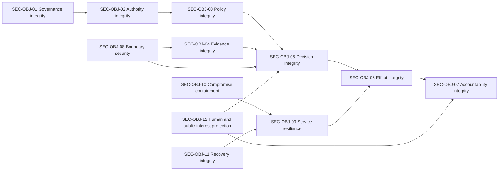

# Security objectives

Security objectives describe the outcomes that ONDTF security controls must preserve. They are intentionally independent of specific technologies and apply across centralised, federated, distributed, and hybrid deployments.

## Objective catalogue

| ID | Objective | Protected outcome |
|---|---|---|
| SEC-OBJ-01 | Governance integrity | Governance decisions, mandates, exceptions, and emergency powers are authentic, authorised, bounded, and reviewable. |
| SEC-OBJ-02 | Authority integrity | Authority grants and delegations are attributable, current, correctly scoped, non-escalating, and revocable. |
| SEC-OBJ-03 | Policy integrity | Policies are authorised, versioned, unambiguously applicable, protected from unauthorised change, and evaluated as intended. |
| SEC-OBJ-04 | Evidence integrity | Evidence and status information are attributable, authentic, relevant, fresh enough, and protected against substitution or suppression. |
| SEC-OBJ-05 | Decision integrity | Consequential decisions are based on the correct authority, policy, evidence, assurance, and risk context. |
| SEC-OBJ-06 | Effect integrity | Executed effects correspond to authorised decisions, remain within scope, resist replay, and can be halted or corrected where required. |
| SEC-OBJ-07 | Accountability integrity | Material actions and decisions produce protected, meaningful, and reviewable evidence. |
| SEC-OBJ-08 | Boundary security | Cross-organisational and cross-domain exchanges do not silently inherit trust or exceed recognised scope. |
| SEC-OBJ-09 | Service resilience | Critical trust capabilities tolerate expected faults and fail safely under dependency loss, overload, or compromise. |
| SEC-OBJ-10 | Compromise containment | A local compromise is detected, bounded, and prevented from becoming an uncontrolled ecosystem failure. |
| SEC-OBJ-11 | Recovery integrity | Recovery restores authorised state, reconciles affected decisions, and re-establishes justified assurance before normal operation resumes. |
| SEC-OBJ-12 | Human and public-interest protection | Security design limits foreseeable harm to affected parties and preserves accessible challenge, correction, and remedy. |

## Objective dependencies

The dependencies do not imply that failure propagates deterministically. They show where an objective relies on evidence or controls supplied by another objective. Profiles should identify which objectives become critical for each covered effect.

## Objective application

For each consequential service or interaction, an adopting framework MUST:

1. identify the applicable security objectives;
2. assign an accountable owner for each objective;
3. identify the failure impact if the objective is not met;
4. define controls and evidence sufficient to support the objective;
5. identify dependencies and external trust assumptions;
6. define monitoring, exception, and reassessment arrangements;
7. define safe-failure and recovery behaviour.

## Impact dimensions

Security impact should be assessed across more than confidentiality, integrity, and availability. At minimum, ONDTF impact analysis should consider:

- harm to a person or affected party;
- unauthorised exercise of public or private authority;
- financial, legal, eligibility, mobility, health, or liberty effects;
- systemic exclusion or discriminatory impact;
- privacy intrusion and correlation;
- loss of evidentiary or procedural fairness;
- loss of service continuity;
- loss of public confidence or cross-domain recognition;
- concentration or capture of governance power;
- inability to correct or remedy an outcome.

A profile MAY define impact tiers, but MUST explain how those tiers influence control strength, assurance evidence, operational monitoring, and recovery expectations.

## Evidence of achievement

Achievement of a security objective must be supported by evidence, not assertion alone. Evidence may include:

- approved governance and authority records;
- policy provenance and change history;
- architecture and boundary analysis;
- control design and operating evidence;
- independent assessment results;
- configuration and software provenance;
- monitoring and incident records;
- decision receipts and audit trails;
- resilience and recovery exercises;
- challenge, correction, and remedy outcomes.

The sufficiency and freshness of this evidence will be defined through the assurance framework developed later in v0.5.0.
