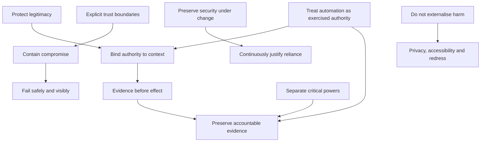

# Security principles

These principles constrain security design, procurement, operation, assessment, and recognition under ONDTF. They are not product requirements by themselves. Profiles and implementations must translate them into controls and evidence appropriate to their risk and operating context.

## SEC-PR-01 — Protect legitimacy, not only access

Security must protect whether an action is legitimately authorised, not merely whether an actor or system has authenticated successfully.

**Implication:** Access control, credential validation, and cryptographic verification must be combined with authority, purpose, policy, and effect checks.

## SEC-PR-02 — Bind authority to context

Authority must be evaluated against the intended action, recipient, purpose, jurisdiction, time, conditions, and downstream effect.

**Implication:** Bearer-style privilege and context-free delegation should be avoided for consequential actions.

## SEC-PR-03 — Evidence before effect

A consequential effect should occur only after required evidence, status, policy, assurance, and authority checks have completed successfully.

**Implication:** Failure to obtain required evidence is not evidence of success. Profiles must define safe deferral or denial behaviour.

## SEC-PR-04 — Separate critical powers

No single actor or component should be able to create authority, alter policy, approve its own operation, execute a consequential effect, and suppress the resulting evidence without independent detection or intervention.

**Implication:** High-impact functions require separation of duties, dual control, independent oversight, or equivalent compensating controls.

## SEC-PR-05 — Make trust boundaries explicit

Every transition between organisations, domains, services, roles, or assurance regimes must be treated as a security boundary unless equivalence is expressly established.

**Implication:** Connected systems do not automatically inherit one another's authority, semantics, assurance, or security posture.

## SEC-PR-06 — Contain compromise

A compromise in one participant, credential, registry, service, dependency, or trust domain must not automatically compromise the entire framework.

**Implication:** Architectures should use least privilege, segmentation, scoped identifiers, bounded credentials, revocation, independent status, and limited recognition.

## SEC-PR-07 — Preserve accountable evidence

Security-relevant decisions and changes must leave evidence sufficient to identify the governing authority, decision basis, responsible actor, applicable policy, time, and outcome.

**Implication:** Logging volume alone is insufficient. Evidence must be meaningful, protected, attributable, and reviewable.

## SEC-PR-08 — Fail safely and visibly

When required security evidence or dependencies are unavailable, the framework must move to a defined safe state and make degradation visible to authorised operators and affected decision paths.

**Implication:** Silent downgrade, stale-data use without disclosure, and automatic fail-open behaviour are prohibited for high-impact actions unless expressly authorised by profile.

## SEC-PR-09 — Preserve security under change

Security properties must survive policy updates, authority changes, software releases, cryptographic migration, provider substitution, federation changes, and emergency operation.

**Implication:** Change control must include impact analysis, compatibility checks, rollback, evidence preservation, and reassessment triggers.

## SEC-PR-10 — Do not externalise security harm

Security controls must account for harms to affected parties, including exclusion, surveillance, coercive disclosure, unchallengeable automation, and concentration of power.

**Implication:** A control is not acceptable solely because it reduces operator risk. Privacy, accessibility, proportionality, and redress must be considered.

## SEC-PR-11 — Treat automation as an exercised authority

Automated agents and decision services must operate under explicit authority, bounded capabilities, monitored dependencies, and reviewable outcomes.

**Implication:** Automation does not dilute accountability or create an independent source of legitimacy.

## SEC-PR-12 — Continuously justify reliance

Reliance must be based on current evidence. Security posture, status, assurance, and recognition can decay or become invalid over time.

**Implication:** Continuous monitoring, freshness rules, reassessment, and withdrawal mechanisms are required for sustained reliance.

## Principle interaction

A profile MUST NOT select one principle in a manner that defeats another without documenting the conflict, decision authority, compensating controls, residual risk, and review period.
