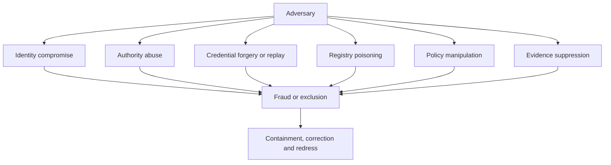

# Adversarial Threat Model

The framework addresses at least the following threat classes:

- synthetic and stolen identities;
- compromised issuers and wallets;
- malicious or negligent verifiers;
- authority escalation and delegation laundering;
- registry poisoning and stale status;
- credential replay, cloning and correlation;
- policy tampering and downgrade attacks;
- insider abuse and governance capture;
- software supply-chain compromise;
- deepfake and biometric injection attacks;
- agent manipulation, prompt injection and tool abuse;
- denial of service and dependency concentration;
- cross-border trust misinterpretation;
- evidence deletion or selective audit disclosure.

