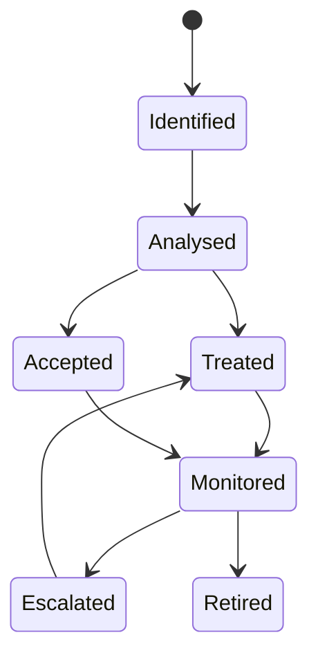

# Threat taxonomy

The ONDTF threat taxonomy provides stable categories for threats to governance, authority, evidence, decisions, effects, accountability, privacy, and continuity. It is deliberately broader than a conventional application-security taxonomy because national digital trust systems can fail through institutional capture, semantic substitution, invalid authority, inaccessible remedy, or ecosystem concentration even when individual software components remain technically secure.

| ID | Category |
|---|---|
| `THCAT-01` | Governance and mandate threats |
| `THCAT-02` | Authority and delegation threats |
| `THCAT-03` | Identity and authenticator threats |
| `THCAT-04` | Credential and evidence threats |
| `THCAT-05` | Registry and status threats |
| `THCAT-06` | Policy and decision threats |
| `THCAT-07` | Effect and execution threats |
| `THCAT-08` | Operations and resilience threats |
| `THCAT-09` | Supply-chain threats |
| `THCAT-10` | Federation threats |
| `THCAT-11` | Privacy and disclosure threats |
| `THCAT-12` | Automated-agent threats |
| `THCAT-13` | Accountability and redress threats |
| `THCAT-14` | Systemic and concentration threats |

## Classification rules

A threat event MUST have one primary category and MAY have secondary categories. Classification does not replace analysis of the relevant adversary, protected asset, security boundary, attack surface, consequence, control, and evidence.

## Lifecycle

The machine-readable source is [`model/security/threat-taxonomy.yaml`](../../model/security/threat-taxonomy.yaml).
