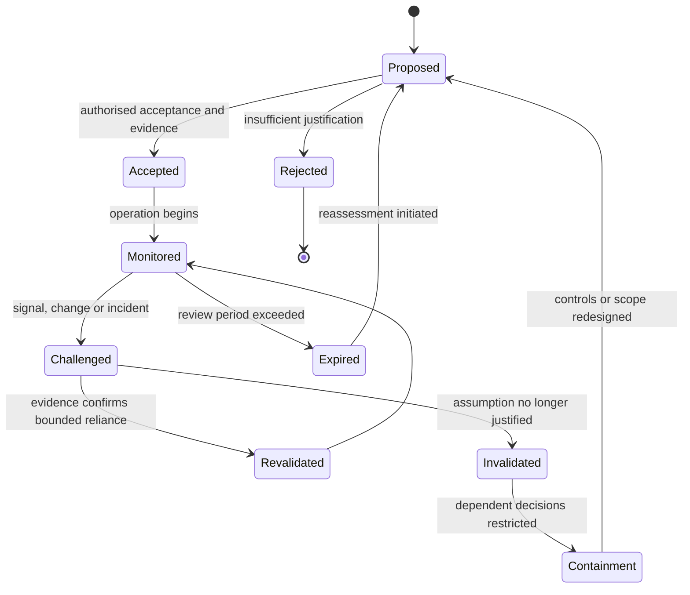

# Trust assumptions

A trust assumption is a proposition that a design or decision relies upon without proving it at the point of use. Every trust system contains assumptions. Security weakness arises when they are hidden, broader than the evidence supports, no longer true, or accepted by a party that lacks authority to bear the resulting risk.

ONDTF requires material trust assumptions to be explicit, bounded, owned, evidenced, monitored, and revisited.

## Assumption record

A material trust assumption SHOULD be recorded with at least:

| Field | Meaning |
|---|---|
| Assumption ID | Stable identifier |
| Proposition | What is believed to be true |
| Scope | Services, actors, data, effects, and jurisdictions covered |
| Rationale | Why reliance is considered justified |
| Evidence | Current evidence supporting the assumption |
| Owner | Authority accountable for accepting the assumption |
| Dependencies | Parties or systems on which the assumption depends |
| Failure impact | Consequence if the assumption is false |
| Monitoring | Signals used to detect invalidation |
| Review trigger | Time, change, incident, or threshold requiring reassessment |
| Treatment | Controls, limits, contingency, or acceptance decision |

## Foundational assumptions

The following are common but must never be accepted implicitly.

### TA-01 — Governance authority is legitimate and current

The framework assumes that governing instruments and decision makers possess valid authority.

**Required challenge:** establish mandate provenance, effective date, scope, supersession, and review route.

### TA-02 — Administrative privilege is exercised as authorised

The framework assumes that privileged operators follow approved procedures and do not collude.

**Required challenge:** apply least privilege, separation, strong authentication, monitoring, dual control, and independent review according to impact.

### TA-03 — Issuers and evidence providers remain competent and uncompromised

The framework assumes that evidence sources continue to satisfy recognition conditions.

**Required challenge:** monitor status, key events, operational posture, incident history, and assurance freshness.

### TA-04 — Registries and status services are sufficiently current

The framework assumes that authoritative records reflect relevant lifecycle changes within an acceptable delay.

**Required challenge:** define update, propagation, cache, outage, and stale-data rules.

### TA-05 — Policy evaluation matches authorised policy intent

The framework assumes that machine-readable or procedural rules faithfully implement approved policy.

**Required challenge:** preserve policy provenance, test interpretation, control versions, and reconcile human and machine-readable forms.

### TA-06 — Cryptographic protection remains suitable

The framework assumes that algorithms, key lengths, implementations, and key custody remain adequate for the protected period and impact.

**Required challenge:** maintain cryptographic inventory, agility, vulnerability response, key lifecycle controls, and migration plans.

### TA-07 — Technical dependencies do not exceed their declared role

The framework assumes that infrastructure, cloud, software, identity, network, and integration providers cannot silently alter authority, policy, evidence, or decisions.

**Required challenge:** minimise dependency privilege, verify outputs, preserve portability, and monitor concentration and supply-chain risk.

### TA-08 — External domains mean what the recognition mapping says they mean

The framework assumes that an external assertion has the semantics, authority, assurance, and lifecycle behaviour declared in a recognition arrangement.

**Required challenge:** validate scope, equivalence, jurisdiction, status, incident cooperation, and withdrawal.

### TA-09 — Decision evidence remains available and trustworthy

The framework assumes that receipts, logs, and evidence can later support review, dispute, investigation, and remedy.

**Required challenge:** protect integrity, provenance, access, retention, confidentiality, and continuity.

### TA-10 — Affected parties can use the redress mechanism

The framework assumes that published challenge and remedy routes are practically accessible.

**Required challenge:** test accessibility, identity requirements, cost, timeliness, non-retaliation, evidence access, and remedy completion.

### TA-11 — Automated agents remain within mandate

The framework assumes that an agent's model, tools, instructions, memory, and runtime controls preserve the principal's valid mandate.

**Required challenge:** bind tool access, constrain authority, validate inputs, monitor action, preserve receipts, and provide intervention and revocation.

### TA-12 — Security controls do not create disproportionate harm

The framework assumes that controls reduce risk without producing unacceptable exclusion, surveillance, or power concentration.

**Required challenge:** evaluate privacy, accessibility, proportionality, alternatives, affected parties, and redress.

## Prohibited implicit assumptions

An ONDTF implementation MUST NOT assume that:

- authentication proves authority;
- possession of a credential proves current eligibility or permission;
- a valid signature proves that the signed proposition is true, lawful, sufficient, or safe;
- a recognised issuer is trustworthy for every claim or context;
- a registry response is current unless freshness is established;
- an assurance label transfers unchanged between domains;
- technical interoperability establishes governance or legal recognition;
- a certified component makes the end-to-end system secure;
- an automated agent is an independent source of authority;
- absence of an incident report proves absence of compromise;
- availability failure justifies silent security downgrade;
- publication of a redress process proves that remedy is accessible or effective.

## Assumption lifecycle

When a material assumption is invalidated, dependent capabilities and recognition decisions MUST be identified and moved to a defined containment, suspension, or reassessment state. Continuing normal operation solely because remediation is inconvenient is not an acceptable treatment.
