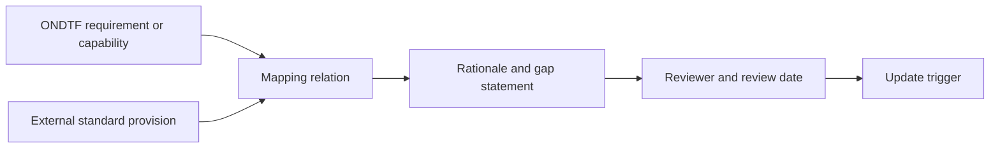

# Standards alignment method

An ONDTF mapping states how an ONDTF requirement or capability relates to an external provision. It is not a legal opinion, certification result or claim of full conformity.

## Mapping relations

- **supports**: ONDTF content helps implement the external outcome;
- **partially supports**: ONDTF covers part of the external outcome;
- **depends on profile**: coverage exists only when a named profile selects additional requirements;
- **related**: concepts overlap but are not equivalent;
- **not addressed**: the external outcome is outside the current ONDTF scope.

Every mapping SHOULD identify the ONDTF source, external clause or outcome, relation, rationale, gaps, evidence expectations and reviewer date.

Mappings MUST be reviewed when either source changes materially.
