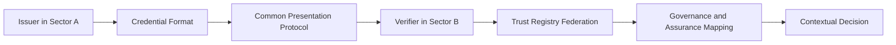

# Interoperability Model

Interoperability has six layers:

1. **Transport:** messages can be exchanged.
2. **Syntax:** data can be parsed.
3. **Semantics:** claims have shared meaning.
4. **Trust:** issuer and authority standing can be resolved.
5. **Assurance:** confidence levels can be compared.
6. **Legal and governance:** credentials and decisions have recognised effect.

A conformance claim MUST specify the exact profile, version, credential formats, protocols, cryptographic suites and trust-resolution methods tested.
