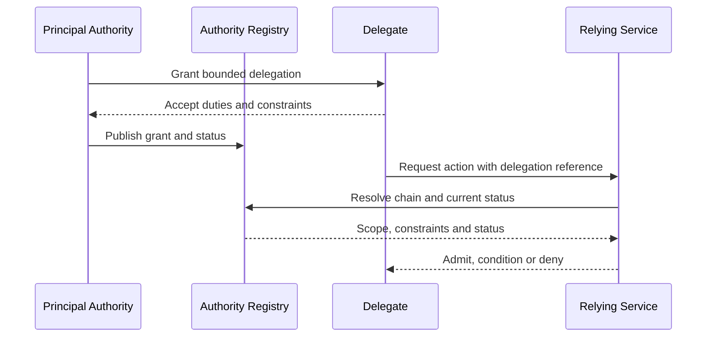

# Authority grant and delegation

A delegation MUST identify source authority, delegate, actions, subjects, purpose, jurisdiction, validity, onward-delegation rights and termination conditions. Every child delegation must be no broader than its parent.

A verifier MUST reject a chain with missing links, expired authority, prohibited onward delegation or incompatible purpose.
