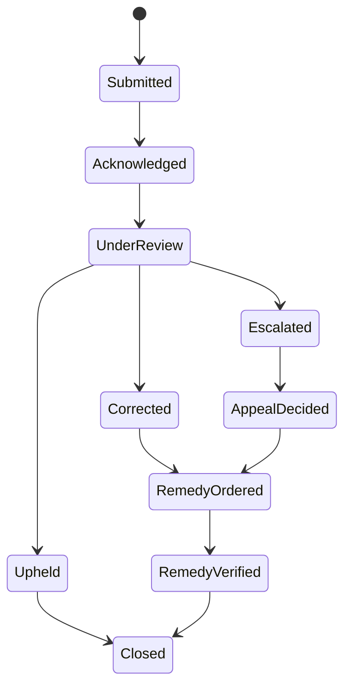

# Challenge, appeal and remedy

A challenge route must be discoverable, accessible and proportionate to impact. The reviewing authority needs access to sufficient evidence to understand the decision while protecting unrelated parties and sensitive security information.

Remedies may include correction, re-evaluation, restoration, suspension, notification, compensation, policy change or systemic remediation. Completion requires evidence, not merely an internal status update.
