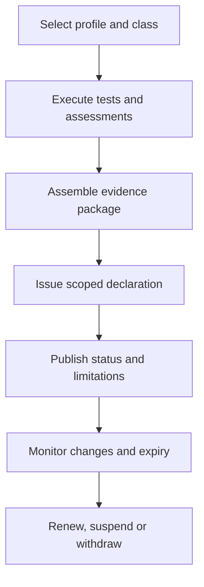

# Conformance declaration

A conformance declaration MUST be scoped to a named profile, version, capability set, deployment boundary and assessment basis.

The declaration must identify exclusions, compensating controls, assessment date, evidence freshness, assessor relationship and expiry. Use of an aligned technology or schema does not itself establish ONDTF conformance.
