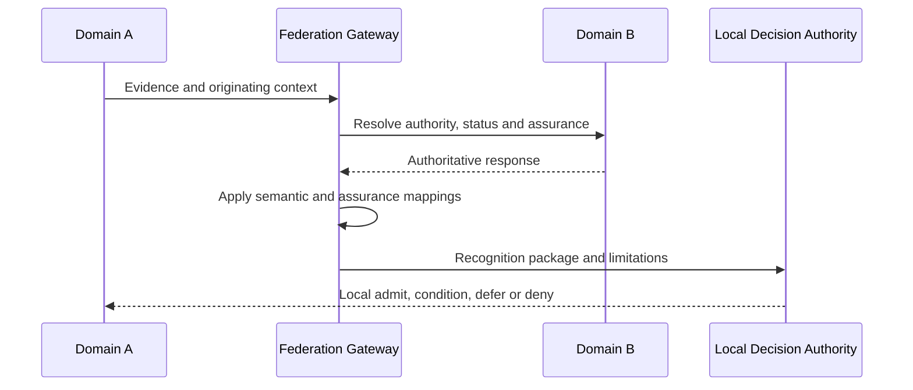

# Cross-domain recognition

Recognition remains a local governance decision. A federation gateway must not silently convert foreign labels into local equivalence. The resulting decision must record mappings, limitations, current recognition status and redress responsibility.
