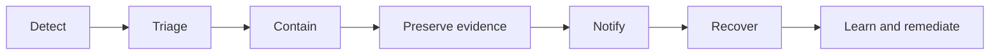

# Incident response

Incident handling must preserve accountability while limiting further harm. The incident authority should coordinate technical containment, status changes, affected-party notice, cross-domain notification and evidence preservation.

A severity model SHOULD consider scale, sensitivity, authority compromise, persistence, irreversibility, vulnerable populations, cross-border reach and redress difficulty.
