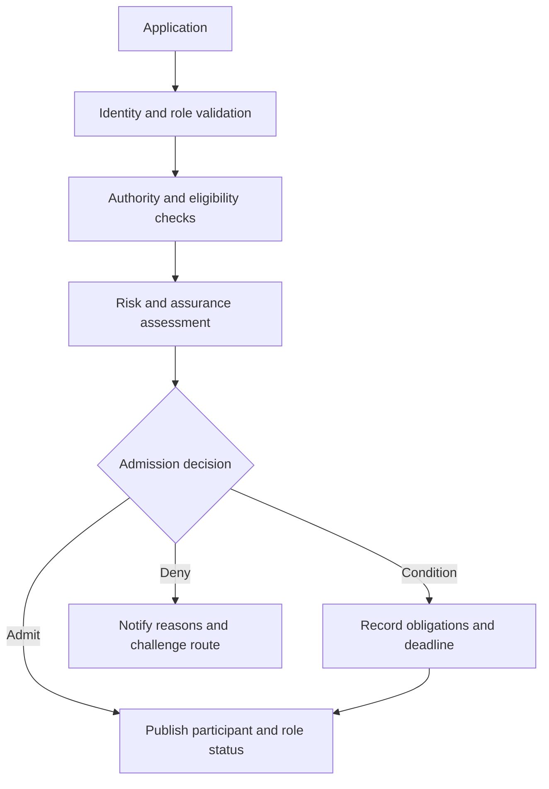

# Participant onboarding

Admission is role-specific. A participant admitted as an evidence provider is not automatically authorised as an assurance provider or scheme operator.

Required evidence includes application, identity and organisational standing, role eligibility, authority, control assessment, conflicts, accepted obligations, decision, effective date and status publication.
