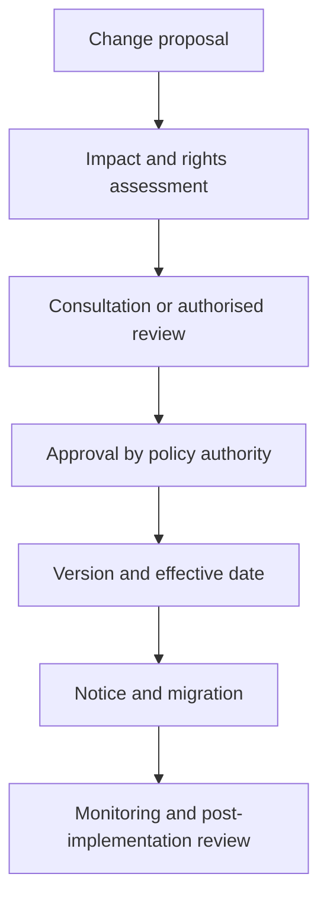

# Policy change and emergency authority

Emergency changes may use an expedited path only where the applicable governance instrument authorises it. The decision must identify urgency, scope, duration, affected parties, compensating controls and mandatory retrospective review.
