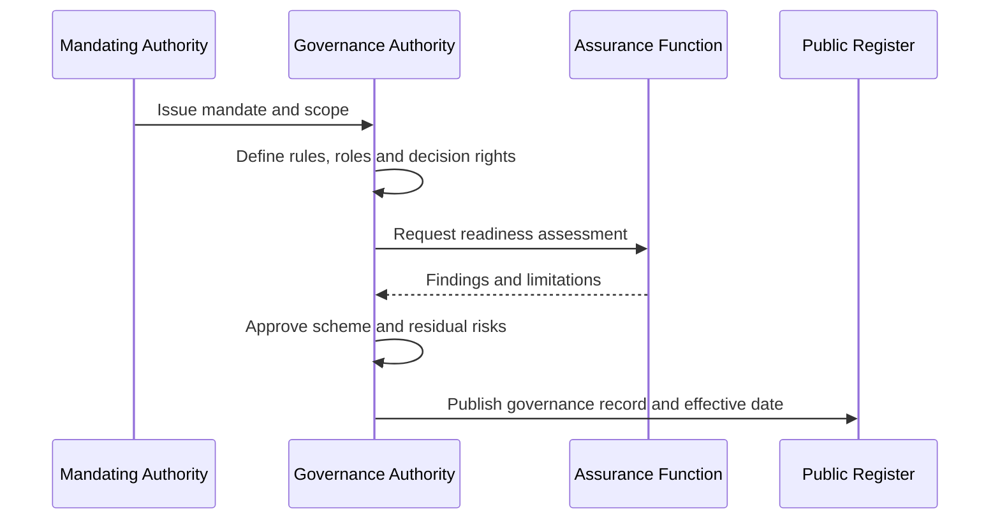

# Trust-scheme establishment

**Purpose:** create a governed scheme with a legitimate mandate, accountable authority, defined participants, controls and redress.

## Preconditions

A lawful or otherwise legitimate mandate, named accountable authority, funding and operating model, risk assessment, and review route must exist.

## Required evidence

Mandate, governance charter, role and decision-right matrix, approved policy set, risk acceptance, assurance report, incident process, redress process, publication record and review date.

## Failure handling

The scheme MUST NOT become active where authority is unresolved, critical controls are absent, or no accountable route exists for affected parties. Conditional approval must identify unmet obligations and a deadline.
