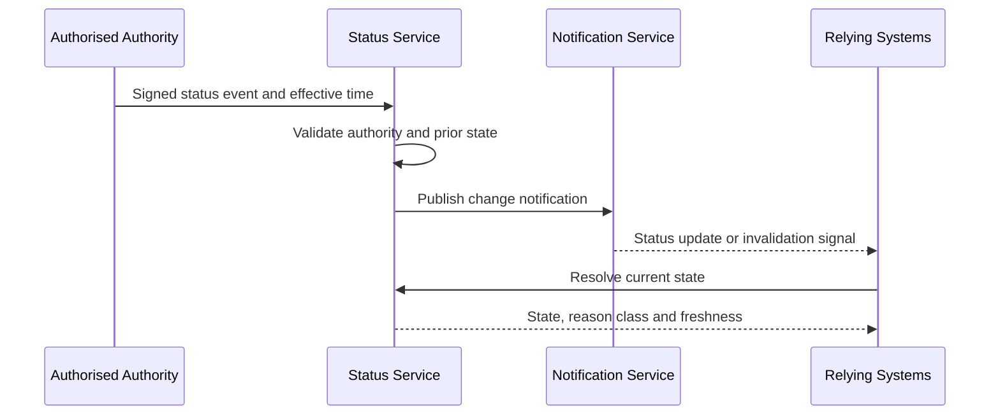

# Status change and suspension

A status change is an authoritative lifecycle event, not merely a database update.

Emergency suspension MAY precede a full investigation where continued operation creates material risk. It must be time-bounded, reviewable and followed by notice and appeal appropriate to the context.
