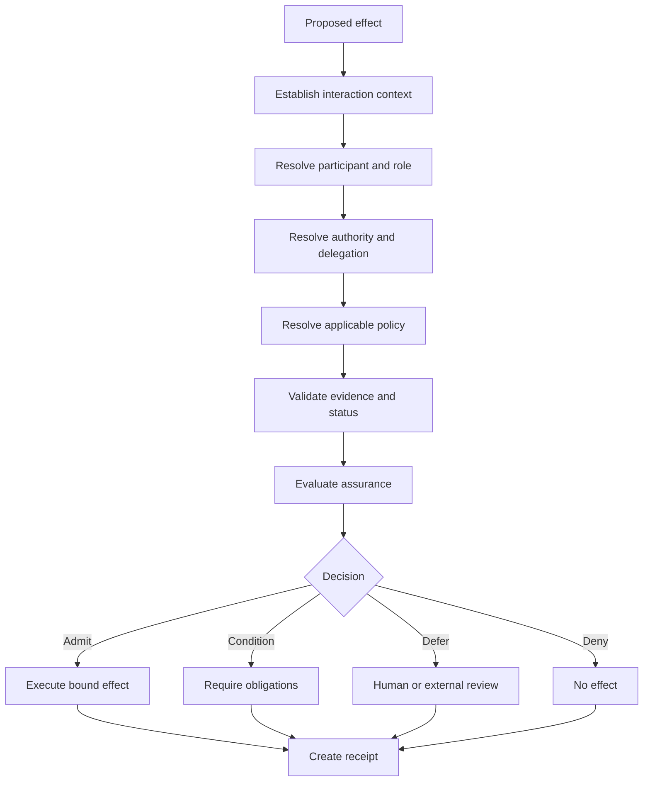

# Trust resolution and effect admission

The decision receipt must identify the interaction context, authoritative sources, policy version, material evidence, outcome, conditions, accountable decision authority and challenge route. Sensitive evidence may be referenced rather than copied.
