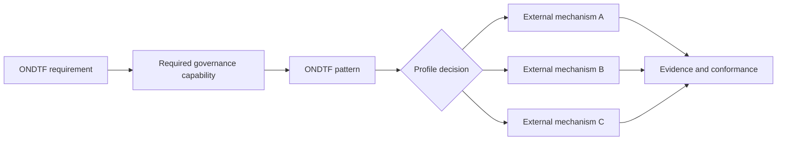

# External pattern portability examples

**Status:** Informative example only. These mappings are not entries in the live external-adoption register and create no ONDTF dependency on DTG, EUDI, OpenID Federation, or any other external ecosystem.

This example pressure-tests ONDTF portability by applying the same governance abstractions to three materially different implementation environments. The purpose is not to claim semantic equivalence between those ecosystems. It is to demonstrate that ONDTF requirements remain stable while profile-selected implementation mechanisms vary.

## Common mapping method



A mechanism belongs below the ONDTF pattern. It does not define the pattern itself.

## Comparative illustration

| ONDTF governance capability | DTG portfolio illustration | EUDI-style wallet illustration | OpenID-Federation-style enterprise illustration |
|---|---|---|---|
| Governed action and decision evidence | Trust Tasks-style governed action | Wallet presentation / relying-party interaction | Federation or enterprise authorization transaction |
| Evidence and proof | Credential/proof mechanisms | PID or attestation presentation | Federation evidence / trust marks |
| Authority and status resolution | Registry/VTI-style status evaluation | trusted-list and provider-status mechanisms | trust-chain and metadata-policy evaluation |
| Conformance / assurance evidence | RAHP, conformance and implementation evidence | scheme/conformity evidence | trust marks and enterprise assurance evidence |
| Implementation runtime | VTI/OpenVTC-style enforcement | wallet and relying-party runtime | federation/IAM runtime |

The table is intentionally capability-oriented. Terms from an external ecosystem are examples of possible implementations, not additions to the ONDTF core vocabulary.

## Substitutability example

A profile may require the capability **governed-action execution** with outcomes such as authority verification, execution-time validity and durable decision evidence. The profile may then select a mechanism and declare its implementation relationship:

```yaml
capability: governed-action-execution
required_outcomes:
  - authority-verification
  - execution-time-validity
  - durable-decision-evidence
implementation_relationship:
  type: substitutable
  alternatives_permitted: true
  exclusivity_justification: null
```

If a competent profile authority instead constrains a profile to one mechanism, the relationship becomes `profile-exclusive` and the adoption record must explain why exclusivity is necessary. The external choice still does not become a universal ONDTF dependency.

## Machine-readable fixture

The companion [`mapping-examples.yaml`](mapping-examples.yaml) records these illustrations in a form that validation can inspect. It is deliberately kept outside `model/profiles/external-adoption-register.yaml` because an example is not an adoption decision.

[Read the portability method](../../docs/adoption/portability-and-external-patterns.md)
