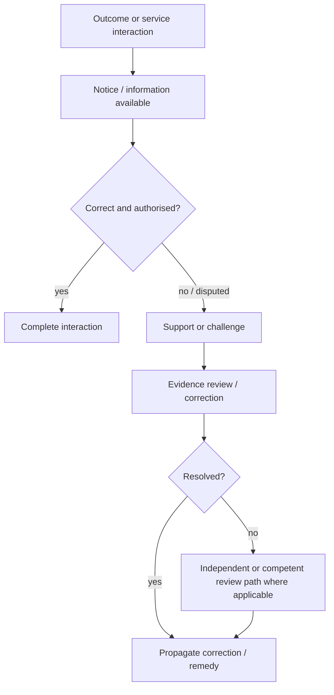

# Australia Digital ID: assurance, rights and conformance

## Assurance interpretation

ONDTF does not import the external ecosystem's assurance vocabulary as universal terminology. Instead, the exemplar asks what evidence a consequential decision would need to establish source, integrity, freshness, authority, operational status and applicable scope.

| ONDTF concern | Worked-exemplar question |
|---|---|
| Authority assurance | What source establishes the actor/provider/service authority for this transaction? |
| Evidence assurance | Is the evidence attributable, intact, relevant and sufficiently fresh? |
| Operational assurance | Is the provider/service/wallet/account currently in an admissible state? |
| Privacy assurance | Is data use limited to declared purpose, scope and applicable consent/legal conditions? |
| Conformance assurance | What exact service/object/version/profile was assessed, and by whom? |
| Remedy assurance | Can an affected person discover and use a correction/challenge/review/remedy path? |

## Conformance boundary

A mapping to ONDTF is **not** a conformance claim. Any future conformance statement would need the scope required by `ONDTF-CON-001`, including ONDTF version, profile, assessed object, organisational boundary, applicable requirements, evidence cut-off and exceptions.

The example also preserves `ONDTF-CON-002`: no external ecosystem used here becomes mandatory for ONDTF core conformance.

## Affected-party journey

This is an ONDTF evaluation pattern. The source register identifies which portions of the external environment are directly supported by authoritative sources and which remedy details require further competent review.

## Evidence expected from the model

- source and authority record;
- profile/dependency versions;
- provider/service/status evidence where applicable;
- transaction/decision receipt where consequential;
- consent or purpose evidence where applicable;
- incident or nonconformity record;
- challenge/correction/remedy record;
- change-impact review when an external dependency changes.

[Previous: Governance and Lifecycle](governance-and-lifecycle.md) · [Next: Source and Provenance](source-and-provenance.md)
