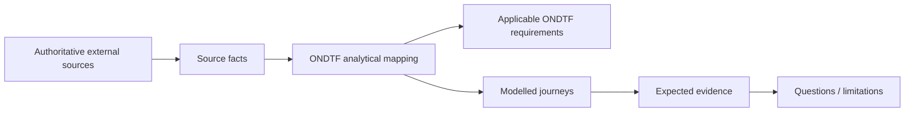

# Australia Digital ID Worked Exemplar

**Status:** Informative worked exemplar  
**Source cut-off:** 14 August 2026

A regulator- and accreditation-led national digital identity environment that distinguishes accreditation from approval to participate in the Australian Government Digital ID System (AGDIS), with explicit privacy, security, accessibility, consent, register, compliance and enforcement surfaces.

{: .warning }
Current-state analytical mapping at 14 August 2026. It is not legal advice, ACCC/DTA guidance, accreditation, or an assertion that ONDTF terminology is used by Australian law.

## Why this example matters

This exemplar tests whether ONDTF can preserve its jurisdiction- and technology-neutral requirements while representing this ecosystem's actual institutional shape. The external system remains authoritative for its own rules; ONDTF supplies an analytical governance, assurance and traceability view.

## Authority basis represented

- Digital ID Act 2024 and supporting Rules/Data Standards
- Australian Competition and Consumer Commission (ACCC) as Digital ID Regulator
- Australian Government Digital ID System (AGDIS) governance and system-administration arrangements

## Institutional-role mapping

| ONDTF analytical role | External actor/mechanism | Responsibility represented | Mapping basis |
|---|---|---|---|
| Digital ID Regulator | ACCC | accredit services; approve participation; compliance and enforcement | official-source |
| System Administrator | Australian Government system-administration function | operate/coordinate AGDIS participation and compliance referral | official-source |
| Accredited entity | identity, attribute or exchange provider | provide accredited Digital ID service within accreditation scope | official-source |
| Participating relying party | approved service using AGDIS | request identity verification within approved participation scope | official-source |
| Individual | Digital ID user / affected party | consent, use, support, complaint and redress interests | official-source |

## Core ONDTF mappings

| Governance concern | External capability represented | ONDTF requirements |
|---|---|---|
| Mandate And Authority | Digital ID Act, Rules and scheme administration | ONDTF-GOV-001, ONDTF-GOV-002 |
| Provider Accreditation And Scope | Accreditation and AGDIS approval are represented as separate governed decisions | ONDTF-GOV-003, ONDTF-ROL-002, ONDTF-CON-001 |
| Status And Registers | Accredited entity / AGDIS participation status is authoritative decision evidence | ONDTF-EVI-003, ONDTF-AUT-002 |
| Privacy And Consent | Additional Digital ID privacy safeguards and express consent become profile constraints | ONDTF-SPR-001, ONDTF-RED-001 |
| Incident And Enforcement | Compliance, incident and enforcement responsibilities are explicit | ONDTF-INC-001, ONDTF-DEC-003 |
| Change And Exit | Material change and termination are governed dependency/lifecycle events | ONDTF-MNT-002, ONDTF-GOV-005 |

## Scenario corpus

| Scenario | What it exercises |
|---|---|
| Provider Accreditation | Provider applies for accreditation and the regulator evaluates the service against accreditation requirements. |
| Agdis Participation | An accredited provider separately seeks approval to participate in AGDIS. |
| Relying Party Use | An approved relying party requests identity verification and applicable consent/privacy conditions are evaluated. |
| Material Change | A material provider/service change triggers notification, impact review and possible reassessment. |
| Incident And Regulatory Response | A material security/privacy incident triggers containment, evidence preservation, notification and regulatory coordination. |
| Suspension And Register Propagation | A restriction or suspension changes authoritative status and relying decisions must consume the current status. |
| Individual Challenge And Redress | An individual disputes an outcome and the profile maps support, complaint, correction and remedy routes. |
| Exit Or Expiry | Accreditation/participation ends and downstream status and dependency effects are reconciled. |

## Read the package

1. [Governance and lifecycle](governance-and-lifecycle.md)
2. [Assurance, rights and conformance](assurance-rights-and-conformance.md)
3. [Source and provenance register](source-and-provenance.md)
4. Machine-readable fixtures under [`model/`](model/)

The machine-readable package preserves mapping status and explicitly distinguishes `source-fact`, `ondtf-mapping`, and `analytical-inference` claims.
