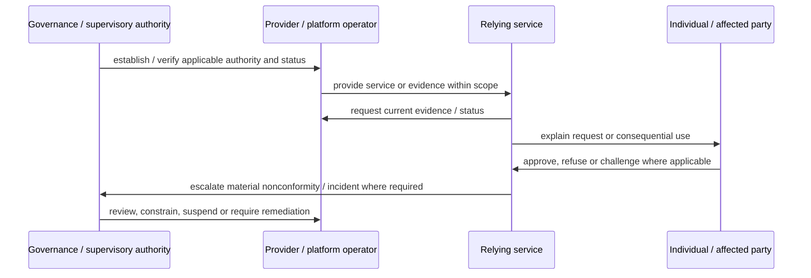

# EUDI Wallet Ecosystem: governance and lifecycle

## Plain-language summary

This page turns the source-backed institutional arrangement into an ONDTF governance view. Modelled lifecycle states are analytical aids, not claims that the external framework uses the same labels.

## Governance flow

## Analytical state model

These states combine wallet, credential and transaction lifecycles for ONDTF analysis. They are not presented as the canonical ARF state machine.

## Responsibility swimlane

## ONDTF controls exercised

- `ONDTF-GOV-001` — authority basis must be explicit.
- `ONDTF-GOV-002` — governance, administration, supervision, assessment and remedy functions must be assigned.
- `ONDTF-AUT-002` — authority is evaluated for scope, purpose, time, conditions and revocation/status.
- `ONDTF-EVI-003` — registry/status information must expose authority, effective time and provenance.
- `ONDTF-INC-001` — material incidents require assigned detection, containment, evidence and coordination responsibilities.
- `ONDTF-MNT-002` — material external changes trigger impact review rather than silently changing ONDTF.

[Next: Assurance, Rights and Conformance](assurance-rights-and-conformance.md)
