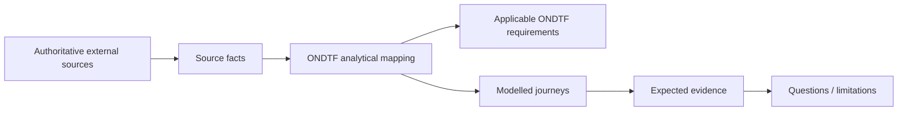

# EU Digital Identity Wallet Ecosystem Worked Exemplar

**Status:** Informative worked exemplar  
**Source cut-off:** 14 August 2026

A multi-jurisdictional wallet ecosystem with EU-level legal authority, Member-State implementation, wallet providers, PID/attestation issuers, relying parties, trust infrastructure, certification and cross-border interoperability/recognition.

{: .warning }
Current-state analytical mapping at 14 August 2026. Regulation (EU) 2024/1183 is in force; implementing regulations and the Architecture and Reference Framework define an evolving implementation environment, and Member States are required to provide EUDI Wallets by the end of 2026. This example is an ONDTF mapping, not an EU conformity, legal or implementation statement.

## Why this example matters

This exemplar tests whether ONDTF can preserve its jurisdiction- and technology-neutral requirements while representing this ecosystem's actual institutional shape. The external system remains authoritative for its own rules; ONDTF supplies an analytical governance, assurance and traceability view.

## Authority basis represented

- Regulation (EU) 2024/1183 establishing the European Digital Identity Framework
- Commission Implementing Regulations
- EU Digital Identity Wallet Architecture and Reference Framework (ARF)
- Member-State authorities and designated/certified ecosystem participants

## Institutional-role mapping

| ONDTF analytical role | External actor/mechanism | Responsibility represented | Mapping basis |
|---|---|---|---|
| EU legislative/regulatory layer | EU institutions | establish common legal and implementing framework | official-source |
| Member State | national competent authorities / wallet provision arrangements | provide or mandate wallet solutions and govern national implementation | official-source |
| Wallet provider | EUDI Wallet provider | provide wallet unit conforming to applicable requirements | official-source |
| PID / attestation provider | authoritative or qualified/non-qualified issuer role | issue PID or attestations according to applicable trust and schema rules | official-source |
| Wallet-relying party | registered relying party/service provider | request presentation for declared purposes and registered scope | official-source |
| Trust infrastructure / registrar | national/EU trust and registration mechanisms | support discovery, registration, authenticity and status | official-source |
| Wallet user | natural person using wallet | control presentation/use and exercise rights/remedy interests | official-source |

## Core ONDTF mappings

| Governance concern | External capability represented | ONDTF requirements |
|---|---|---|
| Multi Level Authority | EU legal/implementing layer and Member-State implementation are represented as layered authority, not one actor | ONDTF-GOV-001, ONDTF-GOV-002, ONDTF-ROL-006 |
| Wallet And Provider Governance | Wallet/PID/attestation roles carry distinct authority, evidence and lifecycle obligations | ONDTF-ROL-001, ONDTF-ROL-002 |
| Relying Party Purpose And Scope | Requests are evaluated in context of registered relying party, purpose and requested data | ONDTF-AUT-002, ONDTF-SPR-001 |
| Cross Border Interoperability | Syntactic and technical interoperability are distinguished from policy/legal recognition | ONDTF-CON-003, ONDTF-EVI-003 |
| Status And Revocation | Wallet/credential/provider status is time-sensitive evidence for relying decisions | ONDTF-EVI-001, ONDTF-EVI-003 |
| Rights And Cross Border Remedy | User challenge/remedy may span issuer, wallet, relying party and jurisdictional responsibilities | ONDTF-RED-001, ONDTF-ROL-006 |
| Version Migration | ARF, implementing rules, schemas and trust infrastructure are controlled external dependencies | ONDTF-GOV-005, ONDTF-MNT-002 |

## Scenario corpus

| Scenario | What it exercises |
|---|---|
| Wallet Provisioning | A Member-State arrangement provides an eligible user with a wallet unit under the applicable governance and certification framework. |
| Pid Provisioning | PID is provisioned to a wallet and source/integrity/status requirements are retained as evidence. |
| Attestation Issuance | An attestation provider issues an attribute credential under its applicable trust regime. |
| Relying Party Registration | A wallet-relying party is registered with declared identity, purpose and requested data categories. |
| Cross Border Presentation | User presents PID/attestation to a relying party in another Member State and interoperability/trust evidence is resolved. |
| Selective Disclosure And Consent | Wallet mediates a request, shows purpose/data request and allows approval/refusal consistent with applicable rules. |
| Status Or Revocation | Credential, provider or wallet status changes and the relying decision consumes authoritative current status. |
| Complaint And Remedy | A user challenges misuse, incorrect data or an adverse outcome across potentially multiple responsible parties/jurisdictions. |
| Version Migration | ARF/implementing-rule or schema/profile changes trigger compatibility and migration review. |

## Read the package

1. [Governance and lifecycle](governance-and-lifecycle.md)
2. [Assurance, rights and conformance](assurance-rights-and-conformance.md)
3. [Source and provenance register](source-and-provenance.md)
4. Machine-readable fixtures under [`model/`](model/)

The machine-readable package preserves mapping status and explicitly distinguishes `source-fact`, `ondtf-mapping`, and `analytical-inference` claims.
