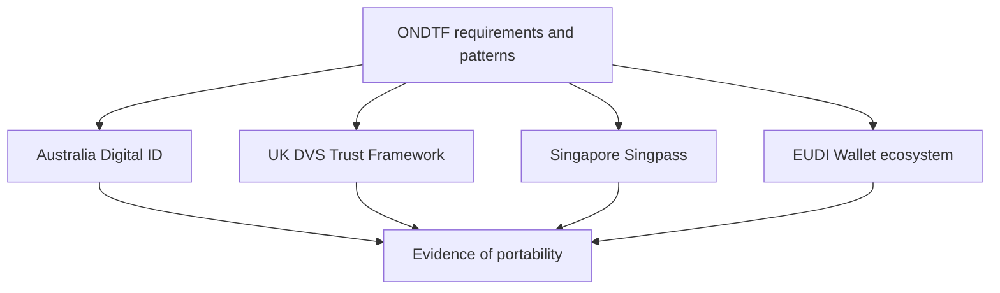

# Real-world worked exemplars

These packages pressure-test ONDTF against four materially different real-world digital trust environments. They are **informative analytical mappings**, not legal advice, conformity claims, governmental endorsements, or assertions that the external ecosystems use ONDTF terminology.

The examples deliberately preserve institutional differences rather than forcing every ecosystem into a common deployment topology.

| Exemplar | Institutional shape | What it pressure-tests |
|---|---|---|
| [Australia Digital ID](../../examples/jurisdiction-exemplars/australia-digital-id/) | regulator + accreditation + system participation | accreditation versus participation, provider lifecycle, privacy, status and enforcement |
| [UK DVS Trust Framework](../../examples/jurisdiction-exemplars/uk-dvs/) | statutory trust framework + independent certification | scoped conformance, CAB independence, register status, version uplift |
| [Singapore Singpass](../../examples/jurisdiction-exemplars/singapore-singpass/) | centrally operated national identity/service ecosystem | authentication versus authority, consented data retrieval, business authority, signing |
| [EUDI Wallet ecosystem](../../examples/jurisdiction-exemplars/eudi-wallet/) | multi-jurisdictional legal + wallet + trust infrastructure | cross-border interoperability, layered authority, recognition, status and remedy |

## Evidence discipline

Each package separates:

1. **source fact** — what an authoritative external source states;
2. **ONDTF mapping** — the analytical relationship to an ONDTF role, requirement, pattern or lifecycle concept;
3. **inference** — any modelled state, transition or responsibility that is useful for analysis but is not asserted to be external terminology.

Every package records a source cut-off date and unresolved questions. External facts must be rechecked before a profile is used for policy, legal, procurement, assessment or production decisions.

[Previous: Worked Operational Profile](../worked-operational-profile/) · [Next: Australia Digital ID](../../examples/jurisdiction-exemplars/australia-digital-id/)
