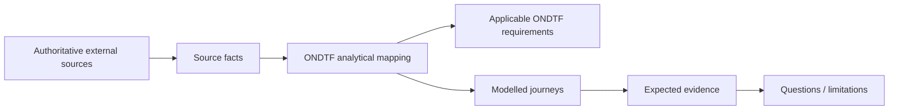

# Singapore Singpass Ecosystem Worked Exemplar

**Status:** Informative worked exemplar  
**Source cut-off:** 14 August 2026

A centrally operated national digital identity and shared-service ecosystem combining authentication, Myinfo consented data retrieval, Corppass business authorisation context and Sign with Singpass secure electronic signatures.

{: .warning }
Current-state analytical mapping at 14 August 2026. Singpass is an operational national digital identity platform rather than a trust framework certification regime. ONDTF mappings therefore focus on operating authority, authentication, consented data retrieval, relying-service integration, signing, business authorisation and affected-party support without inventing an accreditation model that the cited sources do not establish.

## Why this example matters

This exemplar tests whether ONDTF can preserve its jurisdiction- and technology-neutral requirements while representing this ecosystem's actual institutional shape. The external system remains authoritative for its own rules; ONDTF supplies an analytical governance, assurance and traceability view.

## Authority basis represented

- Government Technology Agency of Singapore (GovTech) operation of Singpass and national digital identity services
- Singpass/Myinfo developer integration rules and service controls
- Electronic Transactions Act context for Secure Electronic Signatures via Sign with Singpass

## Institutional-role mapping

| ONDTF analytical role | External actor/mechanism | Responsibility represented | Mapping basis |
|---|---|---|---|
| Platform operator | GovTech Singapore | operate Singpass and associated national digital identity services | official-source |
| Individual | eligible Singpass account holder | authenticate, approve data sharing, sign, recover/manage account | official-source |
| Relying digital service | government agency or business service integrated with Singpass | request authentication and approved attributes for a declared service purpose | official-source |
| Government data source | participating government agency datasets | provide authoritative data made available through Myinfo subject to consent/integration rules | official-source |
| Business authorisation service | Corppass context | bind authenticated individual access to business authorisation context | official-source |
| Signing trust service | Sign with Singpass / National Certification Authority context | support secure electronic signature transactions | official-source |

## Core ONDTF mappings

| Governance concern | External capability represented | ONDTF requirements |
|---|---|---|
| Operating Authority | GovTech operates the national identity service and associated integration surfaces | ONDTF-GOV-001, ONDTF-GOV-002 |
| Authentication Vs Authority | Authentication is treated as evidence of identity/session, not universal authority to perform an action | ONDTF-AUT-001, ONDTF-AUT-002 |
| Consented Data Retrieval | Myinfo data retrieval is represented as evidence access governed by authentication, consent and declared purpose | ONDTF-EVI-001, ONDTF-SPR-001 |
| Business Authorisation Context | Corppass illustrates separation between individual authentication and organisational authority context | ONDTF-AUT-002, ONDTF-AUT-003 |
| Secure Signing | Sign with Singpass produces transaction evidence whose integrity and legal effect are distinct from authentication alone | ONDTF-EVI-001, ONDTF-DEC-003 |
| Support And Recovery | Account support/recovery and service disputes are affected-party operational paths | ONDTF-RED-001, ONDTF-INC-001 |

## Scenario corpus

| Scenario | What it exercises |
|---|---|
| Account Registration | Eligible user registers and activates Singpass with required authentication controls. |
| Service Login | A relying service initiates Singpass authentication and consumes the authenticated result. |
| Higher Risk Verification | A higher-risk transaction triggers Singpass Face Verification or stronger user verification. |
| Myinfo Consent | User authenticates and consents to retrieval of selected personal data from participating sources. |
| Business Action | Individual authenticates with Singpass while Corppass supplies business-authorisation context. |
| Secure Signature | User signs a document with Sign with Singpass and the output is tamper-evident Secure Electronic Signature evidence. |
| Account Recovery | User changes device/credentials or recovers access using controlled account-management flows. |
| Support And Challenge | User encounters account or transaction difficulty and follows support, correction or service-specific dispute routes. |

## Read the package

1. [Governance and lifecycle](governance-and-lifecycle.md)
2. [Assurance, rights and conformance](assurance-rights-and-conformance.md)
3. [Source and provenance register](source-and-provenance.md)
4. Machine-readable fixtures under [`model/`](model/)

The machine-readable package preserves mapping status and explicitly distinguishes `source-fact`, `ondtf-mapping`, and `analytical-inference` claims.
