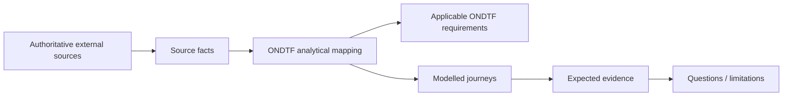

# UK Digital Verification Services Trust Framework Worked Exemplar

**Status:** Informative worked exemplar  
**Source cut-off:** 14 August 2026

A statutory trust-framework and independent-certification model in which service roles, conformity assessment, public registration, trust-mark use, surveillance/renewal and scoped claims can be expressed separately.

{: .warning }
Current-state analytical mapping at 14 August 2026. The final DVS Trust Framework 1.0 has been published but, at this cut-off date, its effective date is no earlier than 1 September 2026 and depends on accreditation of at least one conformity assessment body. This example therefore models the 1.0 target regime without asserting that all 1.0 certification pathways are already operational.

## Why this example matters

This exemplar tests whether ONDTF can preserve its jurisdiction- and technology-neutral requirements while representing this ecosystem's actual institutional shape. The external system remains authoritative for its own rules; ONDTF supplies an analytical governance, assurance and traceability view.

## Authority basis represented

- Part 2 of the Data (Use and Access) Act 2025
- Digital Verification Services Trust Framework 1.0
- Office for Digital Identities and Attributes (OfDIA) / Department for Science, Innovation and Technology (DSIT)
- UKAS accreditation and approved conformity assessment bodies

## Institutional-role mapping

| ONDTF analytical role | External actor/mechanism | Responsibility represented | Mapping basis |
|---|---|---|---|
| Framework authority | DSIT / OfDIA | publish and maintain statutory DVS trust framework; administer regime functions | official-source |
| Accreditation body | UKAS | accredit conformity assessment bodies against the certification scheme | official-source |
| Conformity assessment body | OfDIA-approved and UKAS-accredited CAB | assess/certify DVS services in scope | official-source |
| DVS provider | registered/certified digital verification service provider | operate service within certified role/supplementary-code scope | official-source |
| Public authority | information source under applicable gateway conditions | provide information through statutory information gateway where lawful | official-source |
| User / relying organisation | consumer or organisation using verification outcome | use scoped service and retain challenge/redress interests | interpreted |

## Core ONDTF mappings

| Governance concern | External capability represented | ONDTF requirements |
|---|---|---|
| Statutory Framework Authority | Act + statutory trust framework establish mandate and controlled requirements | ONDTF-GOV-001, ONDTF-GOV-005 |
| Independent Conformity Assessment | OfDIA approval + UKAS accreditation + CAB certification separate governance and assessment roles | ONDTF-GOV-002, ONDTF-ROL-003, ONDTF-ROL-004 |
| Scoped Conformance | Certification applies to named service/role/supplementary-code scope rather than a generic compliance claim | ONDTF-CON-001, ONDTF-CON-003 |
| Public Registration And Status | Register/certification status becomes evidence for reliance decisions | ONDTF-EVI-003, ONDTF-AUT-002 |
| Information Gateway | Public-authority information access is purpose/scope constrained | ONDTF-AUT-002, ONDTF-EVI-001 |
| Version Uplift And Expiry | Evaluation and uplift rules make change/expiry consequences explicit | ONDTF-GOV-005, ONDTF-MNT-002 |

## Scenario corpus

| Scenario | What it exercises |
|---|---|
| Cab Readiness | A CAB is approved and accredited before certifying against the applicable scheme. |
| Service Certification | A DVS service is assessed against the trust framework, role requirements and applicable supplementary code. |
| Register Entry | A certified service is represented on the public DVS register with explicit scope. |
| Scoped Reliance | A relying organisation verifies that the service and relevant use-case scope are valid before reliance. |
| Information Gateway | A registered DVS requests information from a public authority under the statutory gateway and declared purpose. |
| Surveillance And Uplift | A service undergoes surveillance/re-evaluation and version uplift to preserve certification status. |
| Expiry Or Removal | Certification expiry/cessation propagates to public registration and relying decisions. |
| Complaint Or Challenge | An affected person challenges a verification outcome or service handling and routes to the responsible organisation/regime path. |

## Read the package

1. [Governance and lifecycle](governance-and-lifecycle.md)
2. [Assurance, rights and conformance](assurance-rights-and-conformance.md)
3. [Source and provenance register](source-and-provenance.md)
4. Machine-readable fixtures under [`model/`](model/)

The machine-readable package preserves mapping status and explicitly distinguishes `source-fact`, `ondtf-mapping`, and `analytical-inference` claims.
