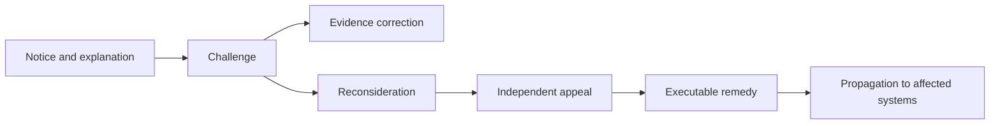

# Assurance, rights and conformance

## Assurance policy

The baseline is AL-2, rising to AL-3 for transactions with a material risk of exclusion or irreversible harm. Authority, status freshness, privacy and remedy readiness are critical dimensions. Failure in one of these dimensions blocks a positive decision even when other evidence is strong.

## Conformance regime

Providers undergo accredited independent assessment before activation, annual surveillance and event-triggered reassessment. Public claims identify scope, version, validity, limitations and current status. A certificate cannot remain presented as active when the underlying service is suspended.

## Rights path

The profile requires an explanation of the evidence source, policy basis, material reason and challenge route. Remedies can include correction, reconsideration, restoration of access and downstream correction notices. Assisted and non-digital channels are mandatory.

[Previous: Operating Model](operating-model.md) · [Next: Risk, Recognition and Maintenance](risk-recognition-and-maintenance.md)
