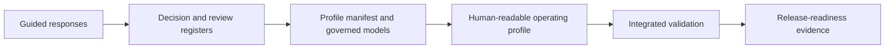

# Worked operational profile

This package demonstrates how ONDTF Guided Framework Construction can be used to produce a coherent, reviewable Digital Trust Framework profile. The fictional **Essential Services Access DTF** is deliberately realistic enough to exercise governance, lifecycle, assurance, conformance, rights, risk, recognition and maintenance controls without asserting legal applicability in any jurisdiction.

## Use this example

1. Read the [profile overview](overview.md).
2. Inspect the [guided construction record](construction-record.md).
3. Follow the [operating model](operating-model.md).
4. Review the [assurance, conformance and rights model](assurance-rights-and-conformance.md).
5. Examine [risks, recognition and maintenance](risk-recognition-and-maintenance.md).
6. Inspect the [validation report](validation-report.md).
7. Reuse the files under `examples/worked-profile/model/` as implementation fixtures.

{: .warning }
This is a worked example, not a deployable legal instrument, certification scheme or governmental endorsement. Every adopter must establish its own authority, consultation record, legal analysis and accountable approvals.

[Previous: Profile Validation](../../profiles/profile-validation.md) · [Next: Profile Overview](overview.md)
