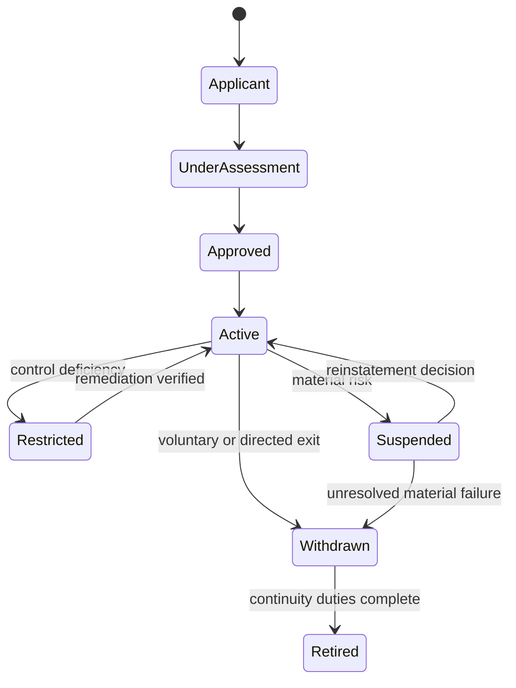

# Operating model

## Institutional allocation

The Governing Authority owns approval, amendment and retirement. The Framework Administrator maintains controlled artefacts. A Supervisory Authority can impose emergency restrictions. Independent conformity assessment is separated from service provision, and the remedy body is separated from registry operation.

## Provider lifecycle

Activation requires authority evidence, successful assessment, registry publication, incident contacts and remedy readiness. Material changes trigger reassessment. Suspension changes public status immediately and starts continuity and affected-party notification duties.

## Decision separation

An assessor may gather evidence and make findings but may not issue the final operational approval for an entity with which it has a prohibited relationship. Appeals are heard independently of the original decision maker.

[Previous: Construction Record](construction-record.md) · [Next: Assurance, Rights and Conformance](assurance-rights-and-conformance.md)
