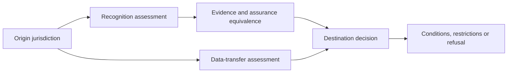

# Cross-border recognition

Cross-border operation creates two separate questions:

1. whether an authority, credential, assurance result, or decision is recognised; and
2. whether data may lawfully and safely move, be accessed, or be processed across borders.

Profiles SHOULD document legal basis, transfer mechanism, location and access, onward transfer, oversight, redress, incident cooperation, evidence equivalence, revocation propagation, and exit arrangements.
