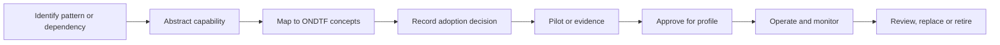

# Dependency and external-pattern adoption governance

External standards, legal instruments, institutional patterns, schemas, protocols, and services enter an ONDTF profile through explicit adoption records. A reference alone does not make an external dependency normative.

## Adoption lifecycle

Each adoption record must state:

- source and version;
- capability or pattern being adopted;
- ONDTF concepts and requirements affected;
- normative or informative status;
- profile scope;
- safeguards against semantic drift or lock-in;
- evidence and conformance implications;
- review owner and trigger;
- migration and retirement conditions.

The machine-readable register is `model/profiles/external-adoption-register.yaml`. The controlled dependency catalogue is `model/profiles/dependency-register.yaml`.

[Previous: Composition and Inheritance](profile-composition.md) · [Next: Versioning and Change](profile-versioning-and-change.md)
