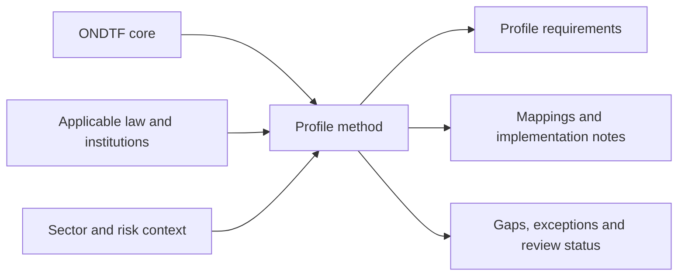

# Jurisdiction profiles

A jurisdiction profile specialises ONDTF for a defined legal, institutional, sectoral, and operational context without weakening the jurisdiction-neutral core.

## Profile documents

- [Profile Methodology](profile-methodology.md)
- [Profile Template](profile-template.md)
- [India Profile](india/)
- [Cross-border Recognition](cross-border.md)

A profile is not legal advice. Legal mappings SHALL state their source, date, status, scope, and review owner.
