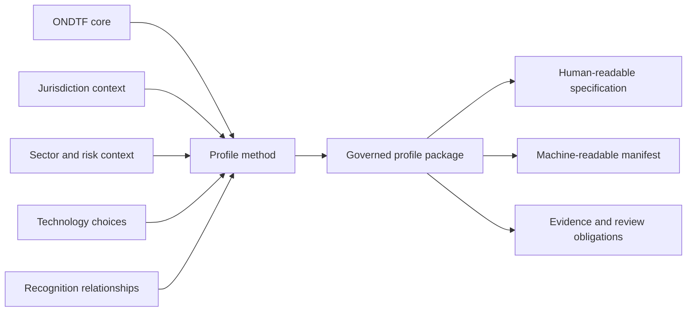

# ONDTF profiles

Profiles specialise the jurisdiction-neutral ONDTF core for a defined legal, institutional, sectoral, technological, recognition, and operational context. A profile is a controlled package of decisions, requirements, dependencies, evidence obligations, and review conditions. It may add constraints or select options, but it must not silently weaken a mandatory core requirement.

## Build or review a profile

1. [Understand profile types](profile-types.md)
2. [Apply the profile construction method](profile-methodology.md)
3. [Use the profile package template](profile-template.md)
4. [Check composition and inheritance](profile-composition.md)
5. [Record dependencies and adoption decisions](dependency-and-adoption-governance.md)
6. [Apply versioning and change control](profile-versioning-and-change.md)
7. [Validate the completed package](profile-validation.md)

## Available profiles and examples

- [India profile](india/)
- [Cross-border recognition](cross-border.md)

{: .important }
A profile is not legal advice, certification, accreditation, or governmental endorsement. Legal mappings require competent review and must record source, date, status, scope, and review owner.
