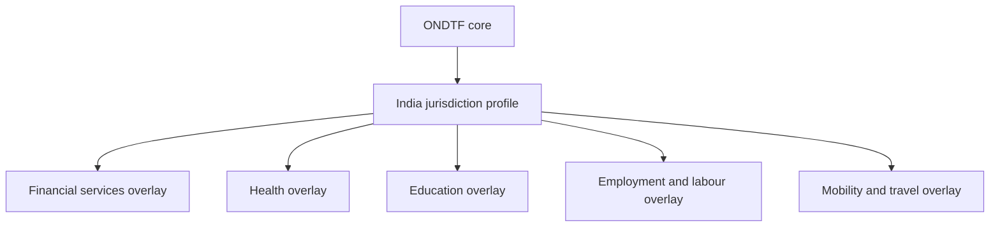

# India profile

The India profile demonstrates how ONDTF can be specialised for a large, federated, multi-sector digital economy. This profile is informative, under development, and does not constitute legal advice, governmental endorsement, or a declaration of compliance.

## Existing infrastructure context

The profile should account for existing public and regulated infrastructure including identity, digital documents, electronic signatures, payments, consented data exchange, health, education, labour, commerce, and sector registries. ONDTF does not replace these systems. It provides a common method for resolving authority, policy, evidence, assurance, effects, accountability, and redress across them.

## Profile work still required

- institutional governance map;
- legal-recognition matrix;
- authoritative-source and registry map;
- standards and protocol selections;
- assurance-level mappings;
- data-protection and retention requirements;
- state and sector federation model;
- grievance, appeal, and remedy integration;
- cross-border recognition profile;
- implementation and conformance plan.

## Current data-protection and cyber-security context

The profile records the Digital Personal Data Protection Act, 2023 and the Digital Personal Data Protection Rules, 2025, including the phased enforcement timeline notified by the Ministry of Electronics and Information Technology on 14 November 2025. Implementers must determine which provisions are in force for their deployment date and role.

The profile also records the CERT-In directions of 28 April 2022 concerning information-security practices and cyber-incident prevention, response, and reporting, where applicable.

An India deployment SHOULD document participant roles under applicable data-protection law, purpose and basis for each personal-data flow, notice and consent handling, security safeguards, breach response, retention and deletion, children's data, cross-border conditions, competent grievance routes, and alignment between ONDTF remedies and statutory rights.

### Primary sources

- Digital Personal Data Protection Act, 2023: https://www.meity.gov.in/data-protection-framework
- Digital Personal Data Protection Rules, 2025 and enforcement timeline: https://www.meity.gov.in/documents/act-and-policies/digital-personal-data-protection-rules-2025-gDOxUjMtQWa
- CERT-In directions under section 70B: https://cert-in.org.in/Directions70B.jsp

This section SHALL be reviewed before release because commencement dates, rules, guidance, board procedures, and sectoral obligations may change.
