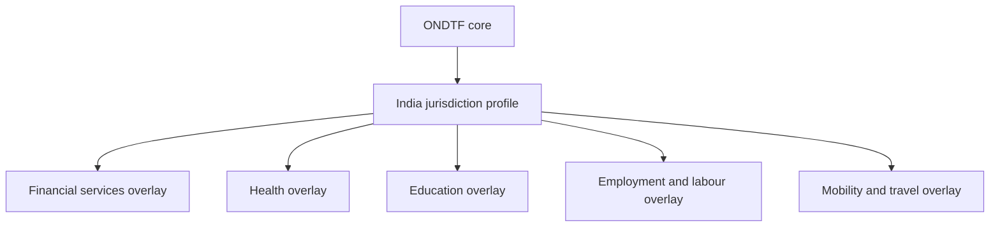

# India Profile — Initial Skeleton

The India profile demonstrates how ONDTF can be specialised for a large, federated, multi-sector digital economy. Version 0.1.0 is deliberately non-normative and does not claim governmental endorsement.

## Existing infrastructure context

The profile should account for existing public and regulated infrastructure including identity, digital documents, electronic signatures, payments, consented data exchange, health, education, labour, commerce, and sector registries. ONDTF does not replace these systems. It provides a common method for resolving authority, policy, evidence, assurance, effects, accountability, and redress across them.

## Profile work still required

- institutional governance map;
- legal-recognition matrix;
- authoritative-source and registry map;
- standards and protocol selections;
- assurance-level mappings;
- data-protection and retention requirements;
- state and sector federation model;
- grievance, appeal, and remedy integration;
- cross-border recognition profile;
- implementation and conformance plan.
