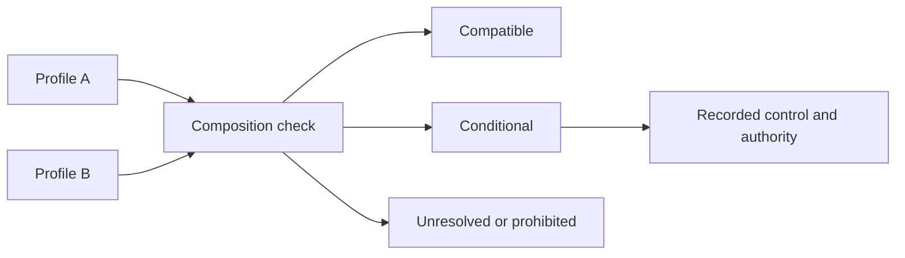

# Profile composition and inheritance

Profile composition combines multiple controlled specialisations without obscuring which authority made each decision.

## Precedence

Unless a governing instrument establishes a stricter rule, the default order is:

1. mandatory ONDTF core requirement;
2. applicable jurisdiction profile;
3. applicable sector profile;
4. approved recognition profile;
5. technology profile;
6. deployment-specific operational profile.

A lower layer may strengthen a requirement but cannot silently reduce a higher-layer obligation. Conflicts must become explicit decision records.

## Conflict outcomes

- **compatible**: requirements can be applied together;
- **stricter-wins**: the higher protection or assurance threshold applies;
- **conditional composition**: coexistence requires a stated control;
- **unresolved conflict**: activation is blocked pending authorised resolution;
- **prohibited composition**: the profiles cannot be combined.

[Previous: Profile Package Template](profile-template.md) · [Next: Dependency and Adoption Governance](dependency-and-adoption-governance.md)
