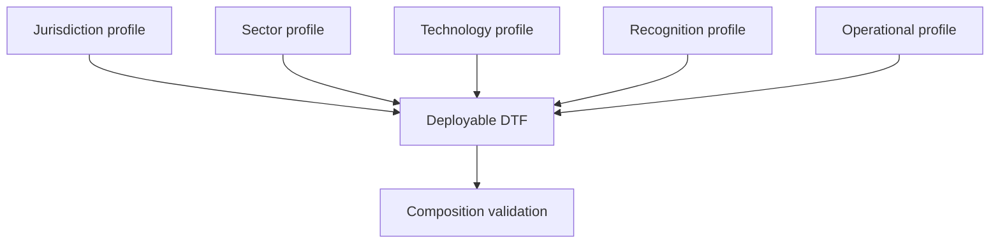

# Profile types

ONDTF uses composable profile types so that legal, sectoral, technical, and recognition choices remain visible rather than being collapsed into one national document.

| Type | Purpose | Typical decisions |
|---|---|---|
| Jurisdiction | Apply ONDTF within a legal and institutional context | authorities, applicable law, statutory rights, oversight |
| Sector | Specialise for a bounded field or risk environment | sector roles, use cases, risk thresholds, records |
| Technology | Select interoperable technical mechanisms | identifiers, credentials, protocols, status, cryptography |
| Recognition | Define how external frameworks or participants are accepted | equivalence, conditions, liability, suspension |
| Operational | Define deployment-specific processes | service levels, incident coordination, continuity, evidence |

A deployable DTF will commonly compose more than one profile type. Composition must identify precedence, conflicts, non-applicable requirements, and the authority that approved each specialisation.

[Previous: Profiles](index.md) · [Next: Profile Methodology](profile-methodology.md)
