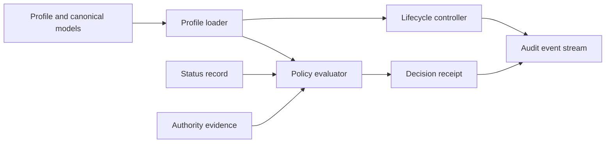

# Reference implementation architecture

The v0.7.0 reference implementation is an **informative executable view** of the normative models. Components deliberately map to governed responsibilities rather than technology products.

A successful software call is never treated as authority. Lifecycle transitions require the role and evidence declared by the canonical lifecycle model; authority evaluation remains distinct from identity or authentication.
